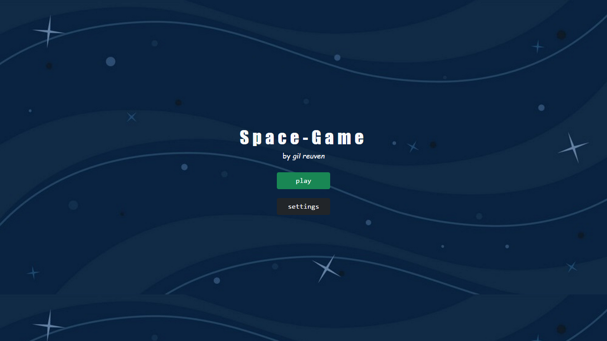
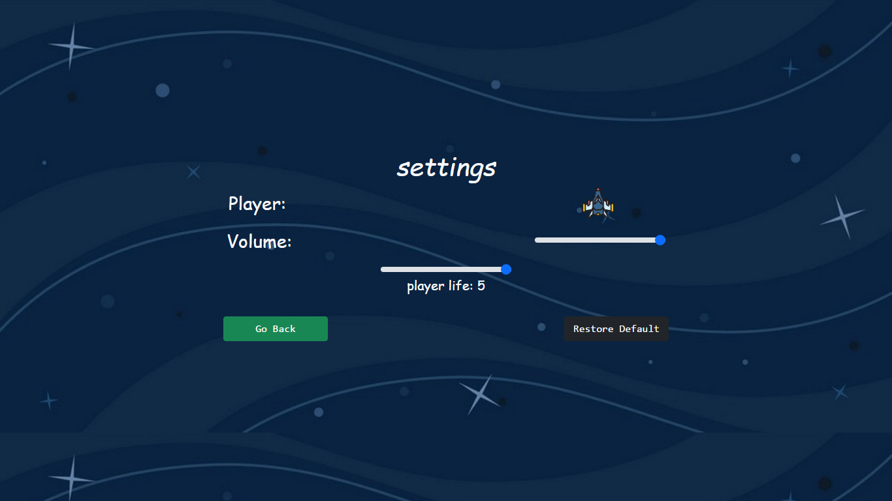
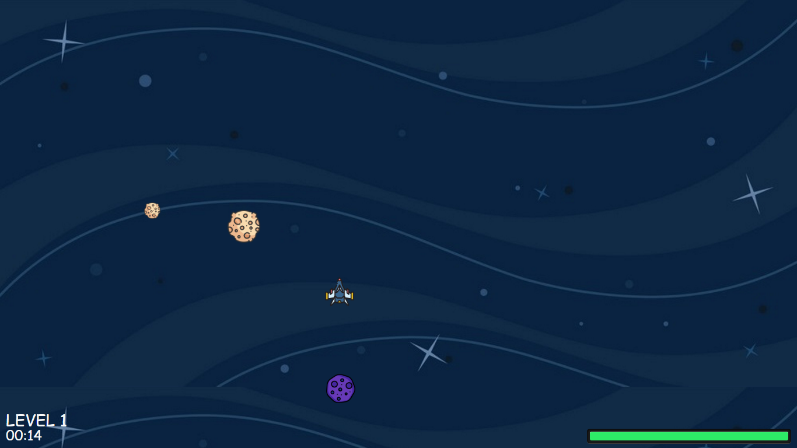

# Welcome to Space Game!
To play the game open [index.html](index.html)

# Set levels/player settings
To change **levels/player** settings open [config.js](config.js) and edit the **defaultConfig** variable ([To learn more about JSON](https://developer.mozilla.org/en-US/docs/Learn/JavaScript/Objects/JSON)).

## Levels:
* Time - Duration of the level.
* N - The number of the level (1 2 3 ...).
* Meteors - an object array with the following data:
	* Start - When will it appear during the level.
	* Size - The size of the meteor (by pixels).
	* Speed - The speed of the meteor.

## Player:
* Size -  The desired  player size(by pixels).
* Speed - Desired player velocity.
* Life - Initial life from 1 to 5 of the player.
# Screenshots
## **Home Window**

## **Settings Window**

## **Game Window**

